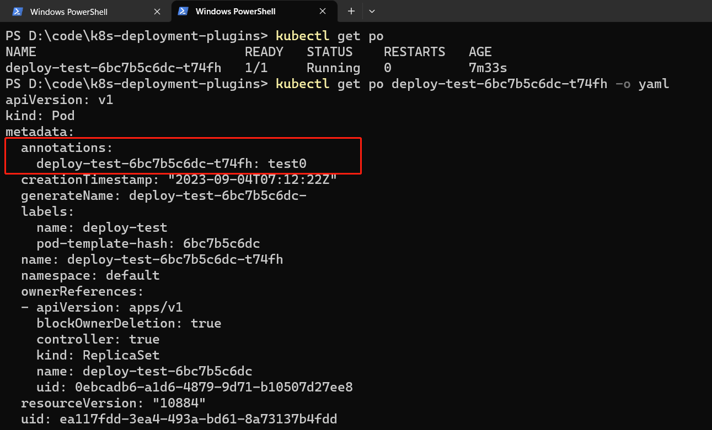

# k8s-deployment-plugin
基于 controller-runtime 为 k8s 原生资源类型 deployment 创建 plugin，修改 pod 属性
> 一起学习k8s吧  
> 有问题联系：2304262737@qq.com

### 功能演示
使用 minikube 搭建 k8s 环境，打开 k8s dashboard，方便看到集群状态，命令行执行`minikube dashboard`  
部署 deploy-test.yaml，`kubectl apply -f deploy-test.yaml`  
查看 pod 的 yaml 文件，可以看到 pod 已经添加了 **annotation** 属性，`kubectl get po <po-name> -o yaml`
